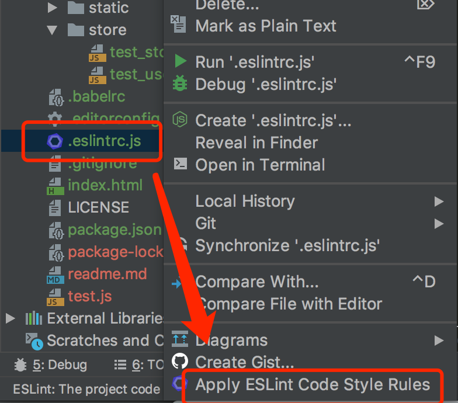

# webpack5-with-vue

webpack5的 vue 脚手架

文档参考 webpack3 版本，使用方法基本没啥区别。

# Vue.js2脚手架（适用于多页项目）

作者：王冬

联系方式：

* qq：20004604
* 微信：qq20004604

## 1、What's in this

Vue2.x脚手架，包含：

* axios（成熟的异步请求封装库，本项目已进行二次封装，方便使用）
* autoprefixer（增加css兼容性前缀）
* babel（实现浏览器兼容）
* eslint（要求代码符合格式才能正常运行，webstorm可以自动格式化）
* less（css预编译器）
* postcss
* webpack5（成熟的打包库）
* uglifyjs-webpack-plugin（代码压缩混淆）
* hotload（热重载，修改代码后不需要刷新）
* 开发模式下ajax转发（本地开发时解决跨域问题）
* 多页模式（按规则建立入口文件，不同入口自动打包为不同html文件）；
* 资源文件夹已分类（并在该文件夹下有相应说明文件）；
* 两个示例demo（见page/test_page）；
* reset.css（重置css样式，使得不同浏览器的样式保持一致）；
* 小图片自动打包到一个static文件夹内；

What's in Vue?

* vue2.6
* vue-router
* vuex


## 2、How to install?

安装

> npm install

开发模式

> npm run dev

生产模式：

> npm run build

打包后从dist文件夹取出数据

## 3、How to use Eslint-config in IDE?

webstorm应用eslint规则（格式化时自动将代码格式化为符合规则的格式）：



editorconfig 配置：


## 4、How to use cli？

### 4.1、入口文件

> 入口文件定义

指webpack的entry属性指向的js文件。

由于 Vue.js 的组件是 ``.vue`` 结尾的，再加上需要前置引入一些依赖，所以 ``.vue`` 文件不能作为入口。

<b>强调：【每次新建一个页面，需要通过新建一个入口文件来实现，并且只需要这样就够了】</b>

> 新建入口文件的方法

目录 ``src/page`` 下，新建一个文件夹，并在文件夹内新建一个 ``app.js`` 文件。该 ``app.js`` 文件即是入口文件。

简单方法：

拷贝脚手架中提供的示例：``src/page/test_demo``，然后改一下文件夹的名字即可。

> 入口文件和常规多个html页面的关系

本脚手架，每次新建一个入口文件便会创建一个html（由脚手架自动处理），因此无需自己新创建html。

当需要更改html引入的js文件时，请更改工程根目录下的 ``index.html`` 文件。js和css文件请按顺序放在html的``<head>``标签内。

假如你需要不同的js入口文件，指向不同的html（即预期打包后的不同html文件，引入的资源不一样），请联系我（联系方式见上）。

> 示例

给了两个示例，分别是：

* 带vue-router、vuex的示例：
其入口文件为 ``src/page/test_page/app.js``
* 纯Vue的示例，其入口文件为 ``src/page/test_demo/app.js``

在示例demo中，已经引入了：vue、vue根组件、公共less配置、封装好的axios异步请求等，如果你需要引入什么依赖，或者vue插件，都可以在app.js里引入。

在第一个示例中，还额外引入了vue-router与vuex。

### 4.2、目录说明

```
.
├── LICENSE	// MIT许可证
├── build		// webpack配置文件夹
│   ├── postcss.config.js	// postcss
│   └── webpack.config.js	// webpack的配置
├── dist
│   ├── css	// css文件都打包到这里
│   │   ├── test_demo.css
│   │   └── test_page.css
│   ├── static	// src/static下的文件会被打包到这里（无论是否引用）
│   │   └──
│   ├── test_demo.html	// src/page/test_demo打包的html
│   ├── test_demo.js	// src/page/test_demo打包的js
│   ├── test_page.html	// src/page/test_page打包的html
│   └── test_page.js	// src/page/test_page打包的js
├── doc	// 工程文档所在文件夹，都放这里
│   └── 01.png
├── index.html	// 模板html，所有生成的html都基于这个来生成的
├── package.json	// npm依赖管理文件，不懂的话不要管他
├── readme.md		// 本说明文件，实际工程中，建议改为其他名字，本文件名留给工程的说明文档
├── src			// 资源文件，你的所有跟业务有关的，都应该在这
│   ├── api
│   │   └── ajax.js	// 封装好的异步请求，你的所有异步请求应该归类在这里，其他地方直接调用引入的方法即可（具体见下方说明）
│   ├── assets	// 小图片、字体文件之类，统一放这里
│   │   └── 小图片.png
│   ├── common	// 一些业务向的配置文件，或公共库文件
│   │   ├── css	// 需要在其他组件里引入的css库放这里
│   │   │   └── reset.css	// 重置css样式，使不同浏览器体验统一
│   │   ├── js	// 需要在其他组件引入的js库，比如你自己写的html选择器
│   │   └── less	// 需引入的less文件，或者less属性配置
│   │   │   └── config.less	// 比如让某个变量等于某些颜色
│   ├── components	// 所有子组件应该放这里
│   │   ├── test
│   │   └── 子组件放在这里，建议每个相关组件，放在同一个文件夹下
│   ├── config	// 这个放环境配置方面的js文件（即跟业务无关的js代码）
│   │   ├── env.js	// 环境配置
│   │   └── http.js	// axios配置，一般情况下不需要改
│   ├── img	// 图片文件夹，图片（大）放在这里
│   │   └── test.jpg
│   ├── page	// 每个文件夹一个页面，入口文件名必须是app.js这样的
│   │   ├── test_demo	// 第一个示例，纯vue项目
│   │   │   ├── app.js	// 入口js文件，一切从这里开始
│   │   │   └── app.vue	// Vue根组件，在app.js里被引入
│   │   └── test_page	// 第二个示例，带vue-rotuer和vuex
│   │       ├── app.js	// 入口js文件，一切从这里开始
│   │       ├── app.vue	// Vue根组件，在app.js里被引入
│   │       └── router  // 本页面的vue-router在这里配置
│   │           └── index.js    // Vue-router的入口文件
│   ├── plugin	// vue插件
│   │   ├── for_development.js
│   │   └── vue的插件，统一放在这里
│   ├── static	// 静态资源文件夹
│   │   └── 静态资源放这里，会被一起移动到打包后的static文件夹下（无论是否被引用）
│   └── store		// vuex的store文件放这里，每个入口一个文件夹
│       ├── test_store	// 对应的是page/test_store
│       └──
├── .eslintrc.js	// eslint，不需要改
├── .editorconfig	// eslint，不需要改
├── .gitignore	// 不会被加入到git列表里的文件
└── .babelrc	// babel配置文件，默认情况下不需要改
```

### 4.3、异步请求

异步请求已经被封装好了，通常情况下，不需要关心相关配置。这里说明一下使用方法。

默认post方式下，以json形式向后端请求

> 1、新增一个异步请求

打开 ``src/api/ajax.js`` 文件，现在代码是：

```
// 上略
const $ajax = {
    // 示例
    test1 (payload) {
        return get('/test', payload);
    },
};
// 下略
```

现有一个请求方式为get，url为 ``/test`` 的测试异步请求。

现根据需求，需要添加一个 post 请求，url为 ``/test_login``，需要传一个对象，测试数据为 ``{ data:1 }``

修改后代码如下：

```
// 上略
const $ajax = {
    // 示例
    test1 (payload) {
        return get('/test', payload);
    },
    test2 (payload) {
        return post('/test_login', payload);
    },
};
// 下略
```

> 2、如何在组件内使用异步请求

在第一步完成后，找到你的组件，假设是 src/page/test_demo/App.vue

先在 template 里添加一个测试按钮吧

```
<button @click="testPost">post测试按钮</button>
```

再新增一个方法，写在 methods 里：

```
methods: {
	// ... 略
    testPost () {
    	 const data = {
            a: 1
        }
        this.$ajax.test2(data).then(result => {
            console.log(result)
        }).catch(err => {
            console.log(`err:${err}`)
        })
    }
}
```

就这么简单。

> 3、如何实现本地开发，请求其他服务器接口

本地开发，请求其他服务器接口，则会涉及到跨域问题，因此是不能直接请求的。

假设我目标服务器的 ip 是：``192.168.0.200:4000``，请求的url地址是：``/test_post``（即和上面2保持一致，相当于是在2基础上增加跨域问题）

首先，打开文件 ``build/webpack.config.js`` ，找到 ``devServer`` 属性，然后找他的子属性 ``proxy``，修改之，参考代码如下：

```
proxy: {
    '/api': {
        target: 'http://192.168.0.200:4000',
        changeOrigin: true,
        pathRewrite: {
            '^/api': ''
        }
    }
}
```

如果是访问本地起的后端服务，道理是一样的。

> 4、post请求不使用json格式（即改使用form表单形式提交）

打开文件：``src/config/http.js``，修改 ``const USE_FORM = false`` 为 ``const USE_FORM = true`` 即可


### 4.4、使用图片

> 图片位置

大图片放在 ``src/img`` 目录下，小图片放在 ``src/assets`` 目录下

> 通过 js 引入图片

示例：

引入 ``assets/knife.png`` 这个图片

```

```

> 通过 css 引入图片

引入 ``img/login.png`` 这个图片

```
#app {
    background-image: url('~img/login.png');
}
```

> 配置方法：

``build/webpack.config.js`` 文件里，``resolve.alias`` 属性
